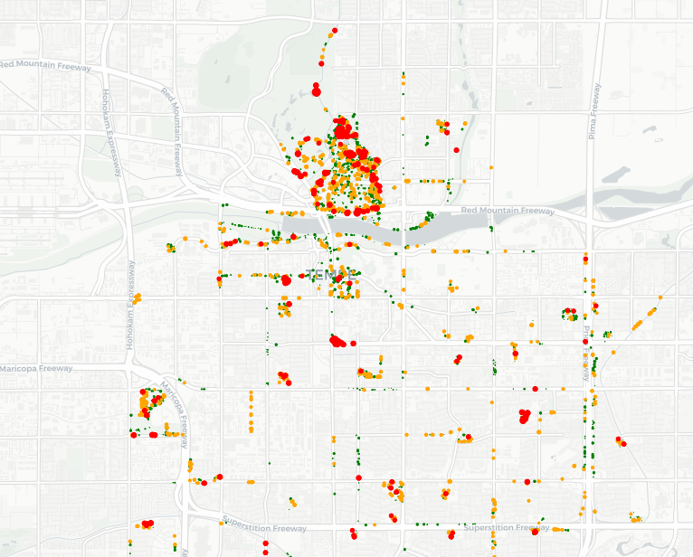
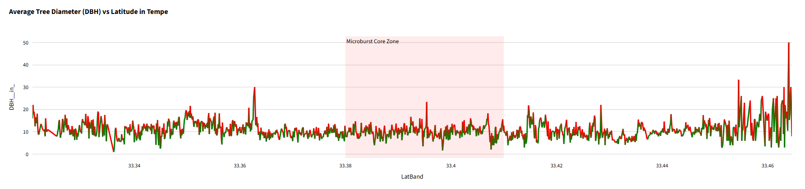
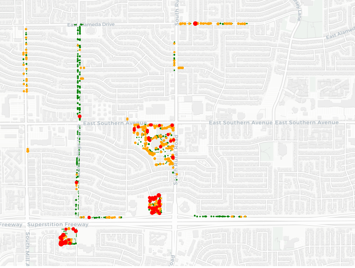
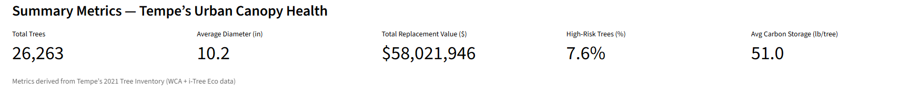

# **Tempe Urban Forest Analytics**
### An Interactive Geospatial Dashboard for Microburst Impact Assessment and Tree Risk Management

Monitoring urban tree canopy health is essential — but identifying **microburst-vulnerable zones** can save lives and infrastructure.
Tempe Urban Forest Analytics introduces a powerful, data-driven Streamlit dashboard that visualizes tree inventory data, risk levels, and environmental benefits using **interactive maps**, **geospatial analysis**, and **carbon impact metrics**.

<p>
  
  
  
  
</p>

---

## Overview

Tempe Urban Forest Analytics answers a critical urban planning question:

> **"Which trees are most vulnerable to microburst damage — and how do we prioritize protection?"**

Using the **City of Tempe's 2021 Tree Inventory shapefile** (WCA + i-Tree Eco v6.0.22 data), this project:

- Maps **40,000+ trees** across Tempe, Arizona with risk classifications
- Identifies **microburst impact zones** using geospatial analysis
- Calculates **carbon storage**, **avoided runoff**, and **replacement value**
- Visualizes tree size trends by latitude (North–South corridor analysis)
- Highlights **high-risk trees** (DBH > 20 inches) for targeted management
- Provides interactive filtering and zoom capabilities for urban planners

This project is **fully interactive**, **production-ready**, and designed for real-world municipal forestry applications.

---

## Key Features

| Category                  | Description                                                              |
| ------------------------- | ------------------------------------------------------------------------ |
| **Interactive Dashboard** | Streamlit-based web app with real-time filtering and exploration         |
| **Geospatial Mapping**    | Plotly scatter mapbox with risk-colored markers (Low/Medium/High)        |
| **Risk Classification**   | DBH-based tree risk scoring (0-10", 10-20", 20"+ diameter classes)       |
| **Microburst Analysis**   | Southern Ave–Kyrene Rd corridor focus with lat/lon bounding              |
| **Environmental Metrics** | Carbon storage, pollution removal, avoided runoff, energy savings        |
| **Trend Visualization**   | North–South DBH gradient analysis with green/red delta highlighting      |
| **Summary Dashboard**     | Total tree count, avg diameter, replacement value, high-risk percentage  |

---

## Dataset

<p>

</p>

- **40,000+ tree records** from 2021 inventory
- **Shapefile format** (.shp) with EPSG:4326 projection
- **Key Attributes**:
  - Tree Species, DBH (diameter at breast height)
  - Replacement Value ($)
  - Carbon Storage (lb), Carbon Sequestration (lb/yr)
  - Avoided Runoff (ft³/yr), Pollution Removal (oz/yr)
  - Latitude/Longitude coordinates
- **Data Provider**: City of Tempe Urban Forestry Division (WCA 2021)
- **i-Tree Eco Version**: v6.0.22

---

## Dashboard Features

<table>
<tr>
<td width="50%" valign="top">

### **1. Summary Metrics Panel**
- Total tree count
- Average tree diameter (DBH)
- Total replacement value ($)
- High-risk tree percentage
- Average carbon storage per tree

</td>
<td width="50%" valign="top">

### **2. Risk Distribution Map**
- Color-coded risk levels:
  - 🟢 **Green**: Low risk (DBH < 10")
  - 🟠 **Orange**: Medium risk (10" ≤ DBH < 20")
  - 🔴 **Red**: High risk (DBH ≥ 20")
- Interactive pan/zoom controls
- Size-proportional markers (DBH-scaled)

</td>
</tr>

<tr>
<td width="50%" valign="top">

### **3. North–South Trend Analysis**
- Average DBH by latitude band
- Green/red delta coloring:
  - Green segments = increasing canopy size
  - Red segments = declining/younger trees
- Microburst core zone shading (lat 33.38–33.41)

</td>
<td width="50%" valign="top">

### **4. Microburst Impact Zone**
- Focused view: Southern Ave–Kyrene Rd corridor
- Bounding box: lat 33.38–33.41, lon -111.96 to -111.92
- High-density tree vulnerability analysis
- Ideal for emergency preparedness planning

</td>
</tr>
</table>

---

## Installation & Setup

### **Prerequisites**
- Python 3.10 or higher
- Git (for cloning repository)

### **Clone Repository**
```bash
git clone https://github.com/yourusername/tempe-tree-inventory.git
cd tempe-tree-inventory
```

### **Install Dependencies**
```bash
pip install -r Data/requirements.txt
```

### **Run Dashboard**
```bash
streamlit run Data/app.py
```

The dashboard will automatically open in your browser at `http://localhost:8501`

---

## Project Structure

```
Tempe Tree/
├── Data/
│   ├── app.py                    # Main Streamlit dashboard application
│   ├── requirements.txt          # Python dependencies
│   └── Tree_Inventory.csv        # Tree inventory data (CSV format)
├── Tree_Inventory.csv            # Root-level CSV (backup/reference)
├── d1.png                        # Dashboard screenshot - Risk Map
├── d2.png                        # Dashboard screenshot - Trend Analysis
├── d3.png                        # Dashboard screenshot - Microburst Zone
├── d4.png                        # Dashboard screenshot - Metrics Panel
├── img1.jpeg                     # Field photo - Storm damage
├── img2.jpeg                     # Field photo - Tree canopy
└── README.md                     # This file
```

---

## Tech Stack

<p>


</p>

**Core Libraries:**
- **Streamlit** — Interactive web dashboard framework
- **GeoPandas** — Geospatial data handling and shapefile processing
- **Plotly** — Interactive mapping and visualization
- **Pandas** — Data manipulation and analysis
- **NumPy** — Numerical computations

---

## Key Insights

### **Microburst Vulnerability Analysis**

The dashboard reveals critical patterns in Tempe's urban forest:

1. **High-Risk Tree Concentration**
   Large, mature trees (DBH > 20") represent the highest wind-damage risk due to increased surface area and structural stress.

2. **Microburst Core Zone (Lat 33.38–33.41)**
   The Southern Ave–Kyrene Rd corridor shows elevated tree density in the 2021 microburst impact zone. Trend analysis reveals a localized reduction in average DBH, indicating storm-related canopy loss.

3. **North–South Gradient**
   Northern Tempe maintains larger, older trees (higher avg DBH), while southern zones show younger replantings and smaller specimens — likely post-storm recovery areas.

4. **Replacement Value at Risk**
   The dashboard calculates total tree replacement value, helping city planners quantify potential economic losses from future severe weather events.

5. **Carbon Storage Benefits**
   Tempe's urban forest provides measurable ecosystem services: carbon sequestration, stormwater mitigation, and air quality improvement. Protecting high-risk trees maintains these environmental benefits.

---

## Use Cases

This dashboard is designed for:

- **Urban Forestry Departments** — Tree inventory management and risk assessment
- **Emergency Management Teams** — Pre-storm vulnerability mapping and response planning
- **City Planners** — Green infrastructure investment prioritization
- **Environmental Researchers** — Urban ecology and climate resilience studies
- **Community Organizations** — Public awareness and tree-planting campaigns

---

## Dashboard Screenshots

### Risk Distribution Map

*Color-coded tree risk levels across Tempe with size-proportional markers*

### North-South Trend Analysis

*Average DBH by latitude showing microburst impact zone*

### Microburst Focus Zone

*Detailed view of Southern Ave-Kyrene Rd corridor*

### Summary Metrics Panel

*Key statistics for Tempe's urban forest health*

---

## Methodology

### **Risk Classification Algorithm**
Trees are classified into three risk tiers based on diameter at breast height (DBH):

```python
Risk_Level = pd.cut(
    DBH,
    bins=[0, 10, 20, 999],
    labels=["Low", "Medium", "High"]
)
```

- **Low Risk (0–10")**: Young, flexible trees with lower wind resistance
- **Medium Risk (10–20")**: Mature canopy providers, moderate structural vulnerability
- **High Risk (20"+)**: Large specimens with high surface area and leverage forces

### **Microburst Zone Identification**
Using geospatial bounding:
```python
focus_zone = gdf.cx[-111.96:-111.92, 33.38:33.41]
```
This isolates the Southern Ave–Kyrene Rd corridor where the 2021 microburst caused significant tree damage.

### **Trend Analysis**
Latitude-based aggregation with delta coloring:
```python
trend_df = gdf.groupby("LatBand")["DBH"].mean()
trend_df["delta"] = trend_df["DBH"].diff()
trend_df["color"] = np.where(trend_df["delta"] >= 0, "green", "red")
```

---

## Future Enhancements

- **Temporal Analysis** — Multi-year inventory comparison (pre/post-storm)
- **Machine Learning** — Predictive modeling for tree failure probability
- **3D Canopy Visualization** — LiDAR integration for vertical structure analysis
- **Real-Time Weather Integration** — NOAA severe weather alerts with tree risk overlay
- **Mobile App Version** — Field data collection and reporting interface
- **Species-Specific Risk Models** — Wind resistance ratings by tree species
- **Economic Impact Calculator** — Storm damage cost estimation tools

---

## Data Sources & Acknowledgements

**Primary Dataset:**
City of Tempe Urban Forestry Division — 2021 Tree Inventory Shapefile
(West Coast Arborists, Inc. + i-Tree Eco v6.0.22)

**i-Tree Eco Methodology:**
USDA Forest Service
[https://www.itreetools.org/](https://www.itreetools.org/)

**Microburst Event Reference:**
National Weather Service Phoenix — August 17, 2021 Severe Weather Event
[https://www.weather.gov/psr/](https://www.weather.gov/psr/)

---

## License

This project is licensed under the MIT License.

**Dataset Usage:**
The Tempe Tree Inventory data is publicly available for research and planning purposes. Please credit the City of Tempe Urban Forestry Division when using this dataset.

---


